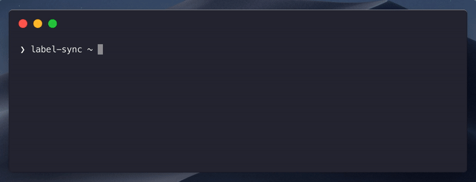

<p align="center"></p>

# creato

[](https://circleci.com/gh/maticzav/creato/tree/master)
[](https://codecov.io/gh/maticzav/creato)
[](https://badge.fury.io/js/creato)

> create-app for any occasion.

`creato` helps you build `create-app` tool to help your customers scaffold their project more easily and more quickly.

## Overview

- ✂️ **Flexible:** Packs core functions as well as the out-of-the-box solution.
- 🌈 **Easy to use:** Exposes intuitive API!
- 🐶 **Friendly UI:** Question and Answer flow leads thorough template installation!

## Installation

```bash
yarn add creato
```

## Example

<p align="center"></p>

```ts
import { creato, Template } from 'creato'
import * as meow from 'meow'

const cli = meow(
  `
create-boilerplates

> Helps you start with the project more quickly and more easily.

Options:
  --force Force the installation in directory.
`,
  {
    flags: {
      force: {
        type: 'boolean',
        default: false,
      },
    },
  },
)

const templates: Template[] = [
  {
    name: 'json',
    description: 'JSON template with basic CircleCI config.',
    repo: {
      uri: 'https://github.com/maticzav/label-sync',
      branch: 'master',
      path: '/examples/with-circleci',
    },
  },
]

creato(templates, {
  force: cli.flags.force,
})
```

## API

```ts
/* templates */

interface Template {
  name: string
  description: string
  repo: TemplateRepository
}

interface TemplateRepository {
  uri: string
  branch: string
  path: string
}

/* creato */

interface Options {
  force: boolean
}

function creato(templates: Template[], options: Options): Promise<void>

/* core */

function loadTemplate(
  template: Template,
  output: string,
): Promise<
  { status: 'ok'; message: string } | { status: 'err'; message: string }
>
```

## License

MIT @ Matic Zavadlal
